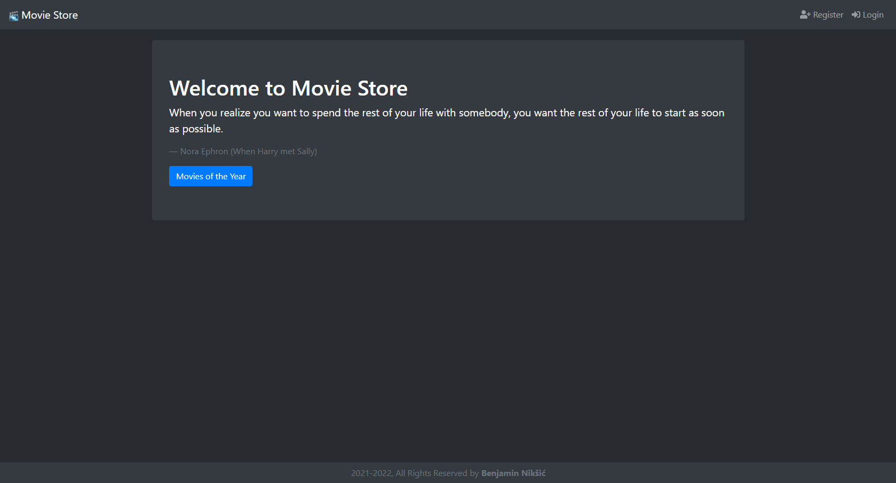
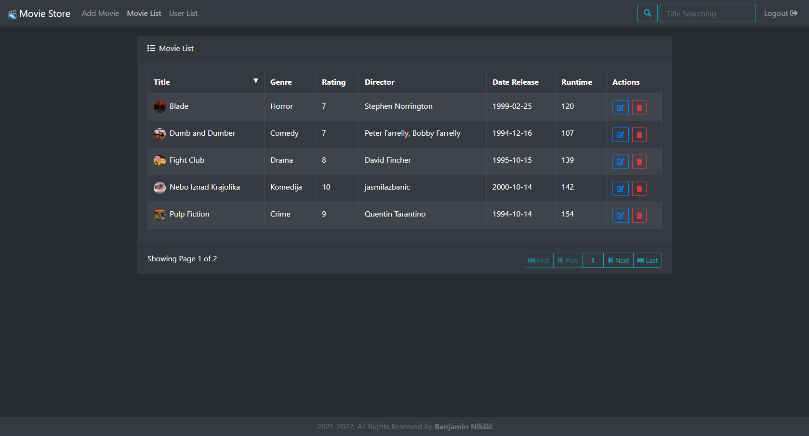

<!-- PROJECT LOGO -->
 

  

  <h3 align="center">Movie store</h3>

<!-- ABOUT THE PROJECT -->
## About The Project

Main focus of this project was learning and practising new technologies for both backend and frontend.

Backend contains model with entities connected to Postgres database with annotations that Spring Boot provides.

List of movies contains implementation of backend sorting and pagination via JPA repository as well as searching by title in nav bar.

Frontend uses react functional components with hooks. Every frontend action is asynchrone and doesn't run reloading page. 

### Built With

This section is list of languages and frameworks that project uses:
* [Java]()
* [Spring Boot]()
    * [Spring Boot Web]()
    * [JPA Repository - Hibernate]()
    * [PostgreSQL JDBC]()
    * [Lombok]()
* [ReactJS]()
    * [Redux]()
    * [Bootstrap]()
* [HTML]()
* [CSS]()
* [JavaScript]()
* [PostgreSQL]()
